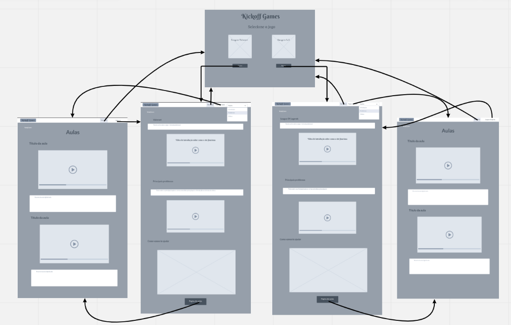
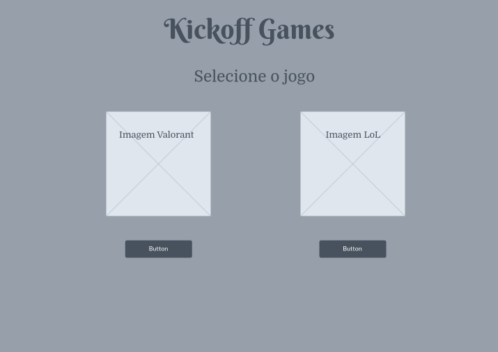
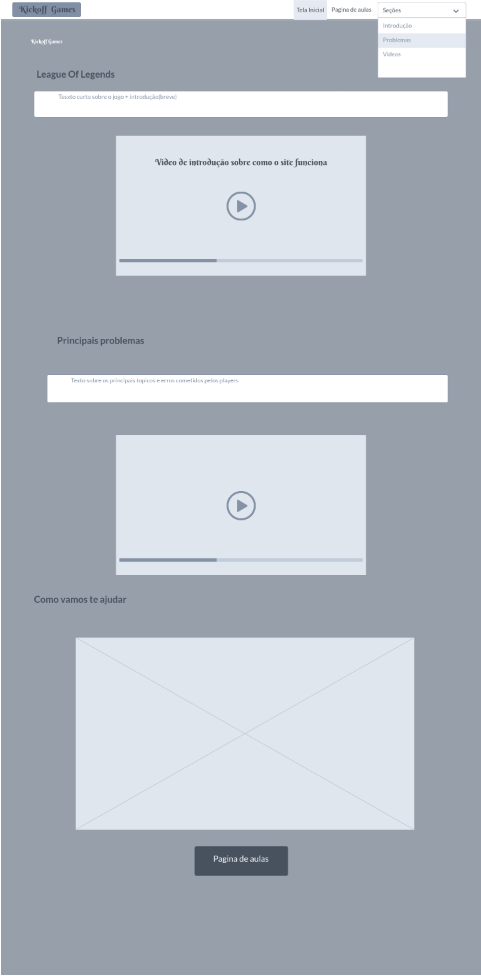
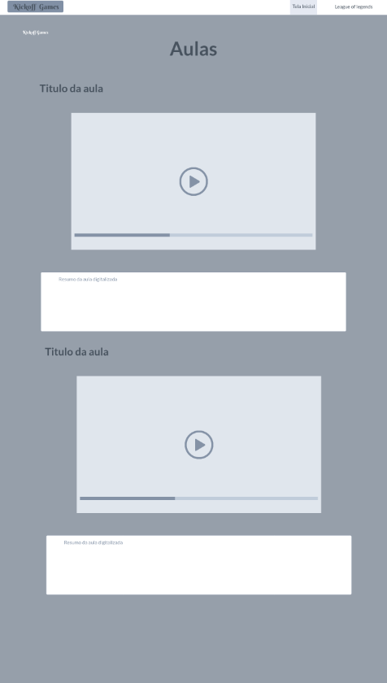
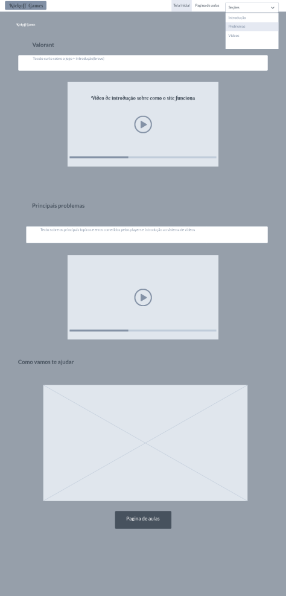
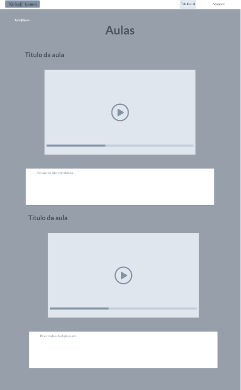

# Informações do Projeto
`TÍTULO DO PROJETO`  

Ser Ruim em E-Games

`CURSO` 

Ciências da Computação

## Participantes

> Os membros do grupo são: 
> - André Luís Marques Antunes
> - Arthur Diniz Mordente
> - Fellipe Gabriel de Oliveira
> - Leonardo Braga de Oliveira
> - Luiz Arthur Campos Almeida
> - Vinicius Ferrer de Queiroz Eloy

# Estrutura do Documento

- [Informações do Projeto](#informações-do-projeto)
  - [Participantes](#participantes)
- [Estrutura do Documento](#estrutura-do-documento)
- [Introdução](#introdução)
  - [Problema](#problema)
  - [Objetivos](#objetivos)
  - [Justificativa](#justificativa)
  - [Público-Alvo](#público-alvo)
- [Especificações do Projeto](#especificações-do-projeto)
  - [Personas, Mapas de Empatia e Histórias de Usuários](#personas-mapas-de-empatia-e-historias-de-usuarios)
  - [Requisitos](#requisitos)
    - [Requisitos Funcionais](#requisitos-funcionais)
    - [Requisitos não Funcionais](#requisitos-não-funcionais)
  - [Restrições](#restrições)
- [Projeto de Interface](#projeto-de-interface)
  - [User Flow](#user-flow)
  - [Wireframes](#wireframes)
- [Metodologia](#metodologia)
  - [Divisão de Papéis](#divisão-de-papéis)
  - [Ferramentas](#ferramentas)
  - [Controle de Versão](#controle-de-versão)
- [Projeto da Solução](#projeto-da-solução)
  - [Tecnologias Utilizadas](#tecnologias-utilizadas)
- [Avaliação da Aplicação](#avaliação-da-aplicação)
  - [Plano de Testes](#plano-de-testes)
  - [Registros de Testes](#registros-de-testes)
- [Referências](#referências)

# Introdução

## Problema

Nos últimos anos jogar jogos digitais se tornou algo comum e cada vez mais pessoas estão explorando esse mundo, seja como lazer ou tratando o jogo como um esporte eletrônico. Como toda atividade competitiva, a prática e habilidade têm grande papel na performance de um jogador, e as vezes o caminho para aperfeiçoar seu desempenho não é muito claro, por isso muitas pessoas desistem de melhorar ou só param de jogar.

## Objetivos

O objetivo ajudar as pessoas que não entendem como melhorar e buscam alavancar seu desempenho em jogos online, mais especificamente League of Legends e Valorant, dois jogos da Riot Games. A ideia inicial é um site que contenha dicas e videos explicativos de como melhorar em vários aspectos dos jogos. Mais especificamente, queremos que o usuário consiga escolher exatamente qual habilidade quer desenvolver e entregar um video ou texto ideal para o problema. Além disso, facilitar o contato entre um jogador ruim e um jogador experiente para que um consiga ajudar o outro.

## Justificativa

Segundo análise feita pelo blog maisesports em 2022, 64,7% dos jogadores de LOL(League of Legends) está nos 3 ranques mais baixos, e outros 32,6% se encontram nos ranques que podemos chamar de medianos. Com certeza existem jogadores que não se importam com isso e só jogam pra se divertir, mas garantidamente existe uma parcela relevante que gostaria de melhorar o desempenho. Porém, hoje em dia apesar de exister conteúdo espalhado na internet, um novato ou veterano desprovido de habilidade não consegue encontrar com facilidade, e por isso nosso aplicativo vai disponibilizar o conteúdo necessário e com fácil acesso para esses jogadores com a vontade de aperfeiçoarem as diversas habilidades que queiram.

## Público-Alvo

Embora jogar jogos online seja algo que qualquer pessoa pode fazer, delimitaremos o público alvo como jovens homens e mulheres de 14 a 25 anos que jogam os jogos abordados com frequência e tem dificuldade de encontrar conteúdo que os auxiliem a melhorar. Adicionalmente, pessoas dessa mesma faixa etária mais experientes que tenham conhecimento sobre os jogos para difundir e ensinar também serão alvo, especificamente ajundando com dicas e com sessões de coaching.

 
# Especificações do Projeto

Após a entrevista definimos o ponto principal do nosso projeto, as partes que deveriam ser focadas e geramos a ideia inicial do nosso sistema, logo após imergimos nas personalidades das personas criadas para o projeto e moldamos nosso sistema a partir do que achamos que seria importante em relação ao tema abordado, consolidamos todos os aspectos citados acima nas personas e na historia do usuário.

## Personas, Mapas de Empatia e Histórias de Usuários

Giovana - 20 anos - Sempre gostou de se divertir e jogar jogos online com os amigos, mas devido às relações tóxicas do passado, acabou desenvolvendo traumas com alguns jogos mais competitivos e frenéticos, tendendo a jogar jogos mais tranquilos e relaxantes. Como esses eventos traumáticos aconteceram há certo tempo, disse estar disposta a voltar e melhorar suas habilidades in-game, principalmente no League of Legends(jogo que gostava bastante antes dos traumas) e também em outros jogos, como Valorant.

Lucas Pontes - 21 anos - Gosta de jogar basicamente qualquer tipo de jogo online, mas tem um amor especial por jogos de FPS(first person shooting). Lucas prefere jogar sempre que pode, mas precisa conciliar o jogo com suas responsabilidades em casa, com isso dedica pouco tempo para melhorar suas habilidades in-game, mas se diz disposto a melhorar, pois sabe que ele pode ter um desempenho muito superior em suas partidas competitivas, principalmente jogando Valorant.

Pedro Alves - 22 anos - Começou na infância almejando uma carreira no futebol porem uma lesão no joelho o impossibilitou de continuar. Porém, Pedro era muito competitivo e isso não o deixava em paz, forçando ele a procurar algum esporte alternativo para competir. Futuramente em sua vida, ele acabou perdendo o Pai de forma trágica e isso o reprimiu muito, mudou seu comportamento completamente, fazendo que ele ficasse mais em casa ao invés de ir se divertir com os amigos e brincar como uma criança normal... E foi assim que ele entrou pro mundo dos e-sports! Hoje Pedro é um atleta profissional de Rainbow Six Siege pela Isurus, onde ele põe todo seu empenho e talento como líder a prova comandando uma das melhores equipes do campeonato argentino e gerencia suas mídia produzindo conteúdo ,que funciona também como algo didático para seus fãs, em suas redes sociais com o intuito de evoluir sua comunidade ao máximo e tornala mais competitiva o possível junto com seu time.

## Requisitos

As tabelas que se seguem apresentam os requisitos funcionais e não funcionais que detalham o escopo do projeto.

### Requisitos Funcionais

|ID    | Descrição do Requisito  | Prioridade |
|------|-----------------------------------------|----|
|RF-001| Permitir a visualização das dicas-valorant| ALTA | 
|RF-002| Permitir a visualização das dicas-league of legends| ALTA | 
|RF-003| Permitir que usuário tenha acesso aos videos em formato de shorts   | ALTA |
|RF-004| Permitir o cadastro do usuário  | ALTA  |
|RF-005| Permitir adição de vídeos na pagina de dicas valorant   | ALTA  |
|RF-006| Permitir adição de vídeos na pagina de dicas league of legends  | ALTA  |
|RF-007| Permitir a edição das dicas na pagina de dicas valorant | ALTA  |
|RF-008| Permitir a edição das dicas na pagina de dicas league of legends | ALTA  |
|RF-009| Permitir a exclusão das dicas na pagina de dicas valorant | ALTA  |
|RF-0010| Permitir a exclusão das dicas na pagina de dicas league of legends | ALTA  |
|RF-0011| Tela inicial | ALTA  |
|RF-0012| Tela de login | ALTA  |

### Requisitos não Funcionais

|ID     | Descrição do Requisito  |Prioridade |
|-------|-------------------------|----|
|RNF-001| Sistema responsivo | MÉDIA | 
|RNF-002| Processamento rápido |  BAIXA |
|RNF-003| O site deve ter suporte para linguas estrangeiras |  BAIXA |
|RNF-004| Cada game deve ter sua PÁGINA  |  ALTA |
|RNF-005| Cada PÁGINA deve ter sua própria paleta de cores (que sejam relacionadas com o game)  |  ALTA |

## Restrições

O projeto está restrito pelos itens apresentados na tabela a seguir.

|ID| Restrição                                             |
|--|-------------------------------------------------------|
|01| O projeto deverá ser entregue até o final do semestre |
|02| Não pode ser desenvolvido um módulo de backend        |

# Projeto de Interface

## User Flow

## Wireframes

Conforme fluxo de telas do projeto, apresentado no item anterior, as telas do sistema são apresentadas em detalhes nos itens que se seguem.

## Tela - Home Page

A tela de home Page é a página inicial onde o usuário deve escolher o jogo que ele deseja se aprofundar sobre.
Componentes: Há 2 botões que levarão o usuário a página sobre o jogo desejado

## Tela - Probelmas LOL

A tela Problemas lol é a pagina onde haverá uma breve introdução sobre o jogo e os principais problemas que atrapalham os players em sua jogatina.
Componentes de Hud : o Hud se compõe de 3 botões, “Tela inicial” que leva o usuário para a Home Page, “pagina de aulas” que leva o usuário para a página Aulas lol, e o ultimo botão “seções “ que deixa o usuário manusear onde ele estará na página atual de problemas.

## Tela - Aulas LOL

Componente Pagina de aulas: é um botão no final da página que exerce a mesma função do botão no hud pagina de aulas.

## Tela - Problemas Valorant

A tela Problemas Val é a pagina onde haverá uma breve introdução sobre o jogo e os principais problemas que atrapalham os players em sua jogatina. Apresenta os mesmos elementos da página de Problemas lol.

## Tela - Aulas Valorant

[Protótipo Interativo](https://marvelapp.com/prototype/e2b8gj1)

# Metodologia

## Divisão de Papéis

> - André Luís Marques Antunes - Personas, Histórias dos usuários, Mapas de empatia
> 
> - Arthur Diniz Mordente - Introdução, Objetivos, Justificativa, Público alvo, Metodologia. 
> 
> - Fellipe Gabriel de Oliveira - Design Thinking, Entrevista, Metodologia, Requisitos Funcionais, Divisão de Papéis, Requisitos Não funcionais, ppt Apresentação. 
> 
> - Leonardo Braga de Oliveira
> 
> - Luis Arthur Campos Almeida
> 
> - Vinicius Ferrer de Queiroz Eloy - Design Thinking, Entrevista, Metodologia, Kanban, Scrum Master, Requisitos Funcionais e Não funcionais.

## Ferramentas

A metodologia é a parte do trabalho que é usada para organização do trabalho tanto na parte da equipe quando na parte das ferramentas usadas no desenvolvimento do nosso projeto.

Ambientes de trabalho:

GITHUB-Repositorio para facilitar o trabalho em equipe a visualização do grupo, além de armazenar o trabalho fisicamente.
https://github.com/ICEI-PUC-Minas-PMGCC-TI/tiaw-pmg-cc-m-20222-10-ser-ruim-em-e-games

MarvelApp- Plataforma usada para criação de interfaçes e Wireframe
https://marvelapp.com/prototype/e2b8gj1

Trello- Plataforma usada para organização e gerenciamento do projeto.
https://trello.com/b/qHfpGEGM/tiaw

Gerenciamento do projeto
Nossa equipe está trabalhando com a metodologia ágil Scrum, sendo assim a equipe foi dividida da seguinte forma:
⦁	Scrum Master: Vinicius Ferrer

⦁	Product Owner:Ilo Amy , Rommel Carneiro 

⦁	Equipe de Desenvolvimento
1.	Felipe Gabriel
2.	Arthur Mordente
3.	Leonardo
4.	Luiz Arthur
5.	Leonardo Braga
6.	André Luis

Estamos usando a plataforma trello para organização do projeto que está estruturada da seguinte maneira:

⦁	Recursos- Nessa parte está localizada a legenda de cores que cita as etiquetas usadas para organizar todas as tarefas em andamento ou concluidas.

⦁	To Do- Uma lista que representa todas as atividades que devem ser trabalhadas mas ainda não foram iniciadas.

⦁	On Going- Outra lista, porém dessa vez de atividades já em desenvolvimento pela equipe.

⦁	Done- Mais uma lista agora retratando as atividades e projetos terminados pelo grupo.

⦁	Discarded- Projetos ou atividades que ocorreram problemas ou foram ideias descartadas pela equipe.

O quadro kanban do projeto, organizado pela equipe está disponivel na URL https://trello.com/b/qHfpGEGM/tiaw, o estado do quadro no momento da entrega da 1 sprint é o seguinte: 

## Controle de Versão

> A ferramenta de controle de versão adotada no projeto foi o
> [Git](https://git-scm.com/), sendo que o [Github](https://github.com)
> foi utilizado para hospedagem do repositório `upstream`.
> 
> O projeto segue a seguinte convenção para o nome de branchs:
> 
> - `master`: versão estável já testada do software
> - `unstable`: versão já testada do software, porém instável
> - `testing`: versão em testes do software
> - `dev`: versão de desenvolvimento do software
> 
> Quanto à gerência de issues, o projeto adota a seguinte convenção para
> etiquetas:
> 
> - `bugfix`: uma funcionalidade encontra-se com problemas
> - `enhancement`: uma funcionalidade precisa ser melhorada
> - `feature`: uma nova funcionalidade precisa ser introduzida
>
> **Exemplo - GitHub Feature Branch Workflow**:
>
> 

# Projeto da Solução

Trataremos agora sobre a parte tecnica do nosso projeto, discorrendo sobre as tecnologias utilizadas, arquitetura de solução, avaliação da nossa aplicação e os testes realizados para identificar os pontos fracos e fortes do nosso projeto.

## Tecnologias Utilizadas

Durante o desenvolvimento do projeto utilizamos diversas tecnologias são elas;

VSCODE

Utilizada para editar e compilar os códigos de HTML,CSS e Javascript

GITHUB

Utilizado para controle de versionamento e organização do projeto.

Bootstrap e Jquery

Usados para facilitar a construção e manipulação dos dados e códigos de HTML, CSS E javascript

Aqui está o userflow, como mostrado na imagem o usuário inicia na pagina onde pode selecionar o jogo o qual deseja prosseguir sua navegação, após isso é levado as respectivas paginas de cada jogo, onde poderá visualizar as dicas e entrar na pagina de cadastro, onde poderá submeter suas dicas para visualização do público geral.

Além disso foram adicionadas novas paginas como por exemplo a de cadastro, para o usuário ter a possibilidade de fazer seu login.

Os wireframes estão localizados no  - [Wireframes](#wireframes), onde pode se notar com mais clareza o que cada pagina citada acima possui de funcionalidade e a suas disposições na pagina.

# Funcionalidades do Sistema (Telas)
# Plano de testes 

A tela inicial onde o usuário deve escolher qual jogo ele quer prosseguir para visualizar as dicas. (RF-011)

Tela de visualização de dicas para ambos os jogos. (RF-001 e RF-002)

Tela para adicionar, editar e exlcuir dicas. (RF-005 a RF-010)(Todas foram unificadas em uma unica página)

Tela de cadastro (RF-004)

Tela de login (RF-012)

Todas foram realizadas nas sprints 2 e 3 pelos membros; Fellipe Gabriel, Arthur Mordente, Leonardo Braga e Vinicius Ferrer

Artefatos da aplicação :

conta.css
estilos.css

aulaslol.html
aulasvalo.html
cadastro.html
cadconta.html
coach.html
index.html
login.html

aulaslol.js
aulasvalo.js
cadcoach.js
conta.js

para a visualização das paginas baixe a pasta base no github localizado no link: https://github.com/ICEI-PUC-Minas-PMGCC-TI/tiaw-pmg-cc-m-20222-10-ser-ruim-em-e-games
descompacte em uma pasta e utilize o vs code com liveserver e navegue livremente pelas paginas citadas acima.

# Avaliação da Aplicação

Visualizar dicas.

|Caso de teste    | Requisitos associados  | Objetivo | Passo a Passo | Criterios para o éxito |
|------|-----------------------------------------|----| ------------- | ---------------------- |
|CT-01| RF-001, RF-002 e RF-003 | Visualizar as dicas armazenadas no mock e posteriormente adicionadas pelo usuário | 1-Abrir o live server 2-Escolher o jogo a ser visualizado 3- Verificar o carregamento das dicas | Dicas armazenadas no mock ou adicionadas pelo usuário exibidas com exíto |

Cadastrar, editar e excluir dicas.

|Caso de teste    | Requisitos associados  | Objetivo | Passo a Passo | Criterios para o éxito |
|------|-----------------------------------------|----| ------------- | ---------------------- |
|CT-02| RF-005 a RF-010| Permitir que o usuário adiciona edite e exclua as dicas(submetidas por ele)  | 1-Abrir o live server 2-Escolher o jogo a ser visualizado 3- Entrar na parte de cadastro de dicas 4- Cadastrar as dicas 5- Editar suas dicas 6-Excluir sua dica | Observar na parte de exibição de dados suas dicas sendo adicionadas, editadas e excluidas. |

Cadastrar o usuário e realizar login.

|Caso de teste    | Requisitos associados  | Objetivo | Passo a Passo | Criterios para o éxito |
|------|-----------------------------------------|----| ------------- | ---------------------- |
|CT-03 RF-004 e RF-012 |Permitir que o usuário faça seu cadastro e login  | 1-Abrir o live server 2-Escolher o jogo a ser visualizado 3- Entrar na parte de cadastro  4- Se cadastrar  5- Fazer login | Conseguir criar e fazer login com sua conta sem ser impedido pelo sistema. |

## Registros de Testes

Todos os testes foram realizados com éxito, com os testes conseguimos identificar vários pontos fortes do nosso sistema, como a funcionalidade de todos os requisitos que ele se propõe a realizar utilizando-se das tecnologias que citamos acima.

Foram identificados também alguns pontos fracos que foram corrigidos e trabalhados para serem aperfeiçoados e afim de manter a funcionalidade completa do nosso projeto.

# Referências
https://www.reddit.com/r/desabafos/comments/lbc85m/sou_muito_ruim_em_qualquer_jogo_pqp/​

https://trello.com/b/qHfpGEGM/tiaw​

https://marvelapp.com/prototype/e2b8gj1​

https://github.com/ICEI-PUC-Minas-PMGCC-TI/tiaw-pmg-cc-m-20222-10-ser-ruim-em-e-games​

https://www.tecmundo.com.br/voxel/especiais/178240-chega-de-noobice-6-dicas-para-melhorar-seu-desempenho-nas-partidas.htm​
